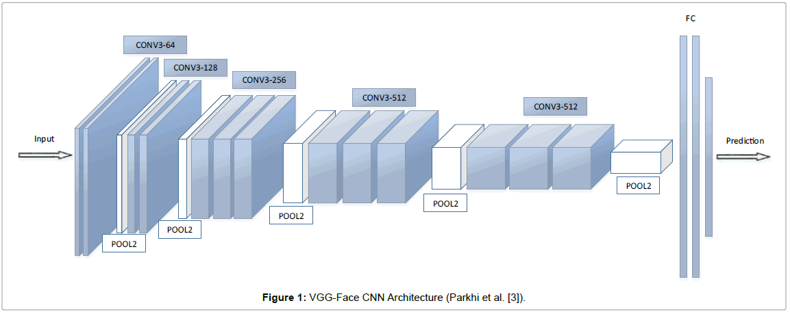
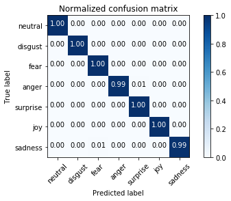

# TakeAPic : A Tool to improve your social media experience
TakeAPic is Data Science product that analyzes the 6 fundemental facial expressions + neutral expression. 

## Web Application: http://takeapic.online/

TakeAPic.online is a webapp that I build and develop by utilizing Google Vision API for my Facial Expression Analyzer. 
TakeAPic can be used as an additional **computerized** eyes for your social media picture uploads. 
The program analyzes your images that you submit in the directory, ranks them with respect to highest happiness and lowest sadness scores; and returns you the top 3 happiest pictures so that you can use them as an album cover or your profile picture. 

Here is a quick video of how the app works. 

## Project Presentation:
Slides for the project:
<a href="https://docs.google.com/presentation/d/e/2PACX-1vSYFRupRBmiBZh3q1zJs5VcbirzJ66oHGLc7fG9kCgjYGJF6SGTEoOlktySnfqu0rnE-rO1yz1elA_2/pub?start=true&loop=false&delayms=15000"> Presentation </a>

Social media like Instagram and Twitter are platforms for both expressing individuality, but also capitalizing on personality. 
This graph shows the *price of posting* to a channel with millions of Followers on four different social media platforms. It can cost almost $50k to promote a post in an Twitter feed with 5M followers, even more on Instagram or Facebook.

The common denominator amongst many successful Instagram influencers is how they convey themselves in photos, where
Psychological studies show that a person’s approachability or collectibility is higher when they appear happier.
How do we, as humans, decide if a person is happy? We see the crow’s feet, pushed up cheeks, muscle movement orbiting the eye, and shape of the mouth

Imagine a dating website and you want to improve your users pictures. TakeAPic can detect a grin being different than a smile, maybe the user can upload a happier picture. Looking at the happiness scores in the Tinder in Seattle, median score is 75% meaning and there are a lot of un-happy photos. Perhaps we have the ability to change them. 

For those unfamiliar with Tinder, you swipe picture left or right, if there is a match then people are connected. Since these pictures ultimately decide your match, you might want the ability to better convey the emotion they desire. Now with TakeAPic, dating apps like Tinder would be able to offer this new product.

## Modelling: Into the Weeds...
I used FERG DB with 256 pixel resolution, using ~ 55700 images. The classes involved:
  * Happiness
  * Sadness
  * Anger
  * Surprise
  * Fear
  * Disgust
  * Neutral
  
I build my model on AWS using Tensorflow, and Nvidia GPU to detect the expression. 
The model I created is a convolutional neural networks, which is the basis of the state-of-the-art computer vision tasks.

Just briefly on how CNNs work:
You take images, pass them through convolutions of each layer which generates features, these features are fed to other layers of convolutions, then at the end you have high order of representation of images
Finally these learned features are fed into a sigmoid function to generate classifications...

By using a in house CNN with 11 hidden layers + sigmoid outlayer, I achieved approximately 99 % accuracy. The confusion matrix is shared below indicated the misidentified classes as fear vs sadness, and anger vs surprise. 

